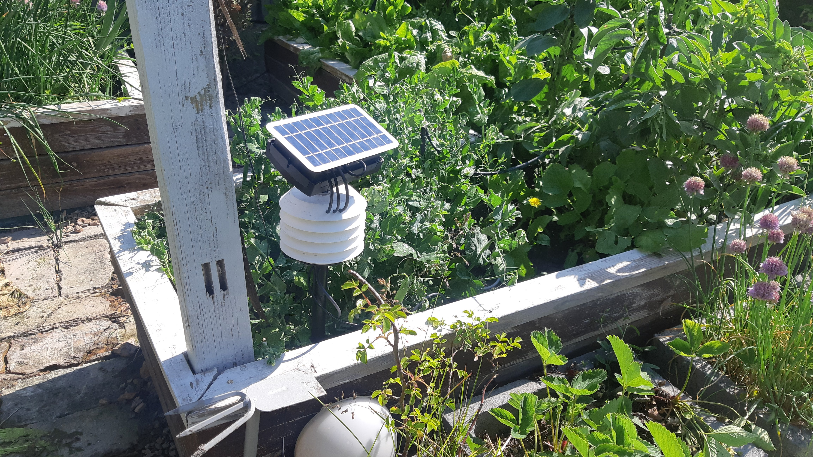

# Plant-Moisture-Garden whit esphome solar + supercap
-------------------------------------------
 REVISION
-------------------------------------------
 2023.05.1.1.0
  - replace AMS2301 by BME280
  - replace TEMT600 by BH1750
  - disconnect ADS1115
  - measure only supercap voltage on ADC pin

 2023.07.10
  replace BME280 by HTU21D whit heater no condensaye humidity
 
 2024.03.19
  - measure moisture soil whit ADC and PWM unsolder lm555
  - delayled I2C start whit custom component
  - Add ina219 measure battery / or alter. ads1115

 2024.03.26
  - replace ESP12F to ESP07
 
 2025.04.10
  - replace esp8266 to esp32 c3 supermini ipex
  - replace supervisor
  - enable heater on htu21d change to sht31
  - add new sensor ec sonde
 

